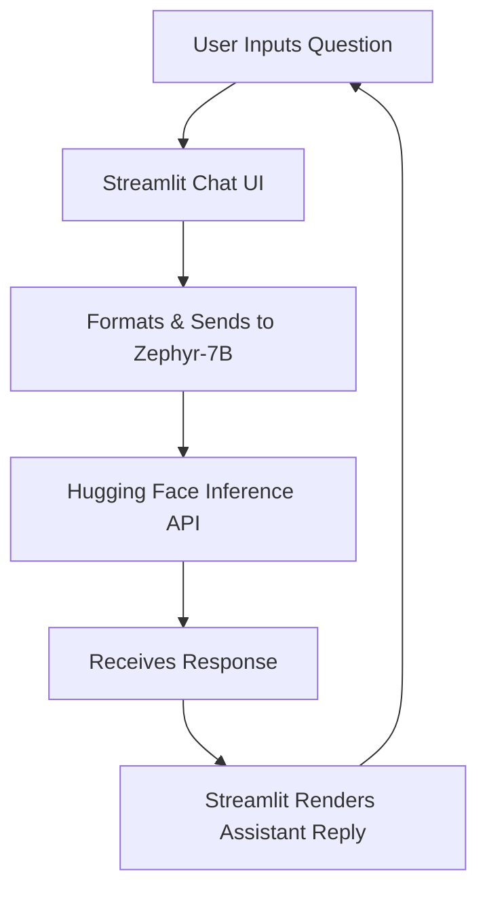

# 🌾 FarminAi – Your AI Farming Assistant 
- [Website](https://farmin-ai.streamlit.app/)

[](https://streamlit.io)  
[](https://huggingface.co/HuggingFaceH4/zephyr-7b-beta)  

> 🤖 **FarminAi** is an intelligent chatbot that helps farmers with expert advice on soil, crops, weather, pests, irrigation, government schemes, and market prices — all in real-time using Hugging Face's Zephyr model.

---

## ✨ Features

- 🧠 **Conversational AI** trained for agricultural context  
- 💬 Styled chat interface (mobile-optimized)  
- 🌍 Real-time queries on weather, crops, soil, and more  
- 🔁 New chat button with full context reset  
- 🔐 Secure token handling via `.env` file  
- 🚀 Pre-warmed model for faster initial responses  
- 📱 Smooth scrolling and responsive design with custom JS & CSS

---

## 🚀 Getting Started

> Follow the steps below to get FarminAi up and running locally:

```bash
# 1. Clone the repository
git clone https://github.com/yourusername/farminai.git
cd farminai

# 2. Create and activate virtual environment
python -m venv venv
source venv/bin/activate        # Windows: venv\Scripts\activate

# 3. Install dependencies
pip install -r requirements.txt

# 4. Create your .env file
echo "MY_SECRET_TOKEN=your_huggingface_token" > .env

# 5. Run the app
streamlit run app.py

```
## ⚙️ .env Configuration

# .env file
MY_SECRET_TOKEN=your_huggingface_token_here

Your Hugging Face token is kept private and secure using python-dotenv.

## 💡 How It Works


## 🎨 Custom UI Features
- 🔘 Chat bubbles for User & Assistant
- 🌗 Clean layout with mobile-first design
- 🧩 Button to reset conversation
- 📜 Smooth auto-scroll script
- 📐 CSS styled typography & hover effects

## 🧠 Prompt Engineering
System Prompt:
You are FarminAi, an AI assistant for farmers. Provide clear, practical, and localized advice
on farming, soil, weather, crops, irrigation, pest control, government schemes, and market prices.
Respond with kindness, simplicity, and accuracy in English.

## 📁 Project Structure

```
├── app.py                 # Main Streamlit application
├── .env                  # Hugging Face API token (not committed)
├── requirements.txt      # Python dependencies
├── assets/
│   └── farminai_screenshot.png  # (Optional) Image preview
└── README.md             # You're here!

```
## ✅ Requirements

- streamlit
- requests
- python-dotenv

## 🌐 Deployment

You can deploy FarminAi to:

- Streamlit Community Cloud
- 🐳 Docker (optional)
- 📦 Your own server
Just make sure to set the MY_SECRET_TOKEN as an environment variable.

## 📬 Contact
Got questions, feedback, or want to collaborate?

📧 Email: vishnuvardhancv128@gmail.com

## ⭐ Love This Project?
If FarminAi helped or inspired you:
- 👉 Star the repo
- 👉 Share with others
- 👉 Fork and improve it!

“Helping farmers with technology — one query at a time.” 🌱


